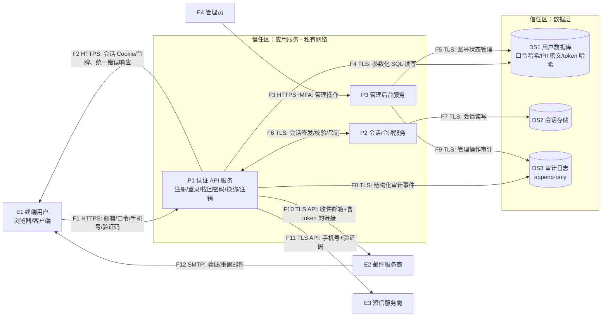

# STRIDE 威胁模型：user-auth（用户注册登录模块）

- 需求来源：实现用户注册登录模块，支持邮箱注册、登录、找回密码；用户数据含手机号和邮箱。
- 上游文档：specs/user-auth/01-soc2-compliance.md（控制项 C-01 ~ C-18）
- 日期：2026-06-10
- 阶段：2/5（STRIDE 威胁分析）

## 1. 系统建模

### 1.1 系统概述

本模块为系统统一身份认证入口，包含：

- **认证 API 服务（P1）**：处理注册、登录、找回密码、邮箱验证、账号设置（换绑/注销）等 HTTP 接口；面向互联网。
- **会话/令牌服务（P2）**：签发与校验会话凭据，支持按用户吊销（逻辑上可与 P1 同进程部署，因信任级别一致，建模为同一信任区内的独立进程）。
- **管理后台服务（P3）**：管理员进行账号管理（封禁/解封/批量强制重置），与用户面隔离部署。
- **用户数据库（DS1）**：账号、口令哈希（argon2id）、PII（字段级加密的邮箱/手机号）、重置/验证 token 哈希、账号状态、同意记录。
- **会话存储（DS2）**：活跃会话/令牌（如 Redis）。
- **审计日志系统（DS3）**：集中、append-only 的安全事件日志。
- **第三方通道**：邮件服务商（E2）、短信服务商（E3），用于验证/重置/通知发送。

部署形态：公有云，互联网入口经 WAF/LB 终结 TLS 后转发至认证 API；数据库与缓存位于私有网络；日志外送至独立日志系统。

### 1.2 数据流图（DFD）

信任边界位置：F1/F2/F3 跨越互联网边界；F4/F5/F7/F8/F9 跨越应用↔数据层边界；F10/F11/F12 跨越组织↔第三方边界；P3 与 P1 之间为权限级别边界（普通用户面 ↔ 管理面）。

### 1.3 元素清单

| 元素 ID | 类型 | 说明 | 所跨信任边界 |
|---|---|---|---|
| E1 | 外部实体 | 终端用户（浏览器/客户端） | TB-01 |
| E2 | 外部实体 | 邮件服务商（SMTP/API） | TB-03 |
| E3 | 外部实体 | 短信服务商 | TB-03 |
| E4 | 外部实体 | 系统管理员 | TB-01 / TB-04 |
| P1 | 进程 | 认证 API 服务 | TB-01 / TB-02 / TB-03 |
| P2 | 进程 | 会话/令牌服务 | TB-02 |
| P3 | 进程 | 管理后台服务 | TB-01 / TB-02 / TB-04 |
| DS1 | 数据存储 | 用户数据库（凭据哈希、PII 密文） | TB-02 |
| DS2 | 数据存储 | 会话存储 | TB-02 |
| DS3 | 数据存储 | 审计日志系统 | TB-02 |
| F1/F2 | 数据流 | 用户 ↔ 认证 API（HTTPS，含凭据与 PII） | TB-01 |
| F3 | 数据流 | 管理员 ↔ 管理后台（HTTPS） | TB-01 / TB-04 |
| F4/F5 | 数据流 | 服务 ↔ 用户数据库 | TB-02 |
| F6/F7 | 数据流 | 会话签发/校验与存储 | TB-02 |
| F8/F9 | 数据流 | 服务 → 审计日志 | TB-02 |
| F10/F11 | 数据流 | 认证 API → 邮件/短信服务商 | TB-03 |
| F12 | 数据流 | 邮件服务商 → 用户（验证/重置邮件） | TB-03 |

### 1.4 信任边界

| 边界 ID | 描述 | 两侧信任级别 |
|---|---|---|
| TB-01 | 互联网 ↔ 认证 API / 管理后台 | 不可信公网 ↔ 受控应用服务 |
| TB-02 | 应用服务 ↔ 数据层（用户库、会话存储、审计日志） | 应用运行时 ↔ 持久化数据（最高价值资产） |
| TB-03 | 认证 API ↔ 第三方邮件/短信服务商 | 组织内受控 ↔ 外部供应商（不受直接控制） |
| TB-04 | 普通用户权限面 ↔ 管理员权限面 | 自助用户权限 ↔ 高权限管理操作 |

## 2. 威胁识别与评级

> 按信任边界分组，每个边界完整覆盖 STRIDE 六类。编号 T-xx 全文唯一，供 SPEC 阶段追溯引用。

---

### TB-01 互联网 ↔ 认证 API（T-01 ~ T-13）

### T-01 凭据爆破与撞库导致账号接管
- **STRIDE 类别**：S（Spoofing）
- **目标元素**：P1（登录接口，数据流 F1）
- **攻击场景**：攻击者使用公开泄露的邮箱/口令组合（撞库）或字典爆破登录接口；无需任何前提条件，自动化工具即可执行。
- **影响**：3 —— 账号被接管，可批量化导致大量用户 PII 泄露与账号滥用。
- **可能性**：3 —— 互联网暴露的登录接口必然遭受撞库，公开工具即可利用。
- **风险等级**：高（9）
- **缓解措施**：
  1. 账号维度失败计数：连续失败 ≥ 5 次指数退避延迟，≥ 10 次锁定 15 分钟并邮件通知（C-04.1）。
  2. IP/设备维度限流：登录接口同 IP 每分钟 ≤ 10 次，超限返回 429 并要求 CAPTCHA（C-04.2）。
  3. 注册/重置时校验泄露口令字典（HIBP k-anonymity），口令长度 ≥ 12（C-02）。
  4. 支持 TOTP MFA，管理员强制启用；新设备/异地登录触发邮箱验证码二次确认（C-03）。
  5. 撞库特征（同 IP 批量失败）触发告警（C-11.4）。
  - **测试**：自动化脚本模拟 11 次失败登录验证锁定与通知；同 IP 高频请求验证 429+CAPTCHA；用 `password123456` 注册应被拒绝。
- **措施类型**：缓解
- **关联 SOC2 控制**：C-02、C-03、C-04、C-11

### T-02 会话劫持与会话固定
- **STRIDE 类别**：S（Spoofing）
- **目标元素**：P2 / 数据流 F2（会话 Cookie）
- **攻击场景**：攻击者通过 XSS 窃取 Cookie、网络窃听、或在登录前植入已知会话 ID（会话固定），冒用受害者会话。
- **影响**：3 —— 完全接管受害者账号会话，可读改 PII、换绑邮箱。
- **可能性**：2 —— 需配合 XSS 或网络位置等前提。
- **风险等级**：高（6）
- **缓解措施**：
  1. 会话 ID ≥ 128 bit CSPRNG 生成；Cookie 设 `HttpOnly; Secure; SameSite=Lax`（C-05.1）。
  2. 登录成功后强制轮换会话 ID，废弃登录前的匿名会话（C-05.2）。
  3. 空闲超时 ≤ 30 分钟、绝对生命周期 ≤ 24 小时；登出与改密/重置后服务端立即吊销全部会话（C-05.2/3）。
  4. 全站 HSTS（max-age ≥ 1 年）防降级窃听（C-08.1）。
  - **测试**：会话固定测试（登录前后会话 ID 必须不同）；改密后用旧令牌请求应 401；扫描 Cookie 属性。
- **措施类型**：缓解
- **关联 SOC2 控制**：C-05、C-08

### T-03 密码重置 token 可预测或可暴力枚举
- **STRIDE 类别**：S（Spoofing）
- **目标元素**：P1（找回密码接口）
- **攻击场景**：重置 token 熵不足（如基于时间戳/自增 ID）或无失效控制，攻击者枚举/预测 token 后冒充用户重置任意账号口令。
- **影响**：3 —— 无需口令即可接管任意账号，可批量化。
- **可能性**：2 —— 取决于实现缺陷，历史上属高发漏洞类别。
- **风险等级**：高（6）
- **缓解措施**：
  1. token ≥ 128 bit CSPRNG 生成，数据库仅存 SHA-256 哈希（防拖库后离线利用）（C-01.2）。
  2. 有效期 ≤ 30 分钟、一次性使用、重新申请后旧 token 立即失效（C-01.2）。
  3. token 校验接口同样纳入 IP 限流与失败计数（C-04.2），防在线枚举。
  4. 重置完成后吊销该用户全部活跃会话并邮件通知（C-05.3、C-11.1）。
  - **测试**：统计采样 token 验证熵与不可预测性；复用/过期 token 自动化测试返回拒绝；枚举速率测试触发限流。
- **措施类型**：缓解
- **关联 SOC2 控制**：C-01、C-04、C-05、C-11

### T-04 注入攻击（SQL/NoSQL）篡改认证逻辑或数据
- **STRIDE 类别**：T（Tampering）
- **目标元素**：P1（所有接收用户输入的接口，数据流 F1→F4）
- **攻击场景**：在邮箱、口令等输入字段注入 SQL/NoSQL 片段，绕过认证（`' OR 1=1`）、读取或篡改用户表。
- **影响**：3 —— 认证绕过、全库读写。
- **可能性**：2 —— 公开工具（sqlmap）可探测，但现代 ORM 下需存在实现疏漏。
- **风险等级**：高（6）
- **缓解措施**：
  1. 全部数据库访问使用参数化查询/ORM 绑定变量，CI 中 SAST 规则禁止字符串拼接 SQL（C-12.1）。
  2. 输入白名单校验：邮箱格式 RFC 5322 校验、手机号 E.164 格式、长度上限（C-16.2 schema 双侧约束）。
  3. 应用数据库账号仅有业务表 DML 权限，无 DDL/系统表权限（C-07.3）。
  4. 上线前 DAST/渗透测试覆盖注入类（C-12.2）。
  - **测试**：sqlmap 对全部认证接口扫描无注入点；SAST 报告零拼接 SQL；注入 payload 自动化回归用例。
- **措施类型**：缓解
- **关联 SOC2 控制**：C-07、C-12、C-16

### T-05 传输链路中间人篡改/降级
- **STRIDE 类别**：T（Tampering）
- **目标元素**：数据流 F1/F2/F3
- **攻击场景**：公共 Wi-Fi 等场景下攻击者实施 SSL strip 或利用弱密码套件降级，篡改登录请求/响应内容（如替换重置链接）。
- **影响**：3 —— 凭据被截获或篡改，账号接管。
- **可能性**：2 —— 需网络中间人位置。
- **风险等级**：高（6）
- **缓解措施**：
  1. 全站强制 TLS 1.2+（推荐 1.3），HTTP 301 → HTTPS，HSTS（max-age ≥ 1 年，includeSubDomains，申请 preload）（C-08.1）。
  2. 禁用弱套件与 TLS 1.0/1.1（C-08.2）。
  - **测试**：testssl.sh / SSL Labs 评级 ≥ A；HTTP 访问验证 301 与 HSTS 头；降级握手测试被拒绝。
- **措施类型**：缓解
- **关联 SOC2 控制**：C-08

### T-06 用户否认认证相关操作
- **STRIDE 类别**：R（Repudiation）
- **目标元素**：E1 / P1
- **攻击场景**：用户声称"账号不是我注册的/重置不是我操作的"，或攻击成功后无法回溯入侵路径，系统缺乏证据链。
- **影响**：2 —— 争议无法仲裁，事件无法取证，影响泄露通知义务履行。
- **可能性**：2 —— 争议与安全事件在认证系统中常态发生。
- **风险等级**：中（4）
- **缓解措施**：
  1. 结构化审计日志覆盖注册、登录成败、登出、口令修改/重置申请与完成、MFA 启停、锁定/解锁，字段含 who/when（NTP 同步 UTC）/where（IP、UA）/what/result（C-11.1）。
  2. 日志集中外送 append-only，应用账号无删改权限，保留 ≥ 1 年（C-11.2）。
  3. 敏感操作（换绑、注销）前重新认证，形成操作意愿证据（C-17.3）。
  - **测试**：触发各事件后核对日志字段完备；以应用账号尝试删改日志应失败。
- **措施类型**：缓解
- **关联 SOC2 控制**：C-11、C-17

### T-07 用户枚举与时序侧信道
- **STRIDE 类别**：I（Information Disclosure）
- **目标元素**：P1（登录、注册、找回密码接口）
- **攻击场景**：通过"用户不存在/口令错误"差异化提示、注册时"邮箱已占用"提示或响应时延差异，批量探测某邮箱/手机号是否为注册用户，为撞库和定向钓鱼提供目标清单。
- **影响**：1 —— 仅泄露账号存在性，但放大后续攻击。
- **可能性**：3 —— 无需任何前提，脚本即可探测。
- **风险等级**：中（3）
- **缓解措施**：
  1. 登录失败统一文案，不区分原因；找回密码无论邮箱是否注册均返回相同提示（C-04.4）。
  2. 注册重复邮箱时不在页面提示"已注册"，改为向该邮箱发送"您已有账号"邮件，接口响应与新注册一致。
  3. 关键路径恒定时间比较（口令哈希校验失败与用户不存在路径执行同等耗时的 dummy 哈希）。
  4. 探测行为纳入 IP 限流（C-04.2）。
  - **测试**：对存在/不存在账号分别请求，断言响应体、状态码一致且时延差异在噪声范围内（差异化测试，C-04 验证方式）。
- **措施类型**：缓解
- **关联 SOC2 控制**：C-04

### T-08 错误信息与调试端点泄露内部细节
- **STRIDE 类别**：I（Information Disclosure）
- **目标元素**：P1 / P3
- **攻击场景**：异常时返回堆栈、SQL 语句、内部路径，或生产环境残留调试端点（如 `/debug`、Swagger 全开放），辅助攻击者构造精准攻击。
- **影响**：2 —— 间接降低其他攻击门槛，可能直接泄露配置。
- **可能性**：2 —— 常见配置疏漏。
- **风险等级**：中（4）
- **缓解措施**：
  1. 全局异常处理中间件，统一错误响应（错误码 + 通用文案），堆栈仅写入服务端日志。
  2. 生产构建禁用调试端点与详细错误模式，CI 部署门禁校验环境配置（C-13.2）。
  3. DAST 扫描覆盖信息泄露类（C-12.2）。
  - **测试**：注入异常输入断言响应不含堆栈/SQL/路径；对已知调试路径扫描返回 404。
- **措施类型**：缓解
- **关联 SOC2 控制**：C-12、C-13

### T-09 重置/验证链接经中间环节泄露
- **STRIDE 类别**：I（Information Disclosure）
- **目标元素**：数据流 F10/F12、P1
- **攻击场景**：重置链接中的 token 经 Referer 头（重置页加载第三方资源时外泄）、浏览器历史、URL 访问日志或邮件转发被第三方获取，直接接管账号。
- **影响**：3 —— 等同重置凭据泄露，账号接管。
- **可能性**：2 —— Referer 泄露与日志记录 URL 属常见疏漏。
- **风险等级**：高（6）
- **缓解措施**：
  1. 重置页设置 `Referrer-Policy: no-referrer`，且页面不加载任何第三方资源。
  2. 落地页将 URL 中 token 立即换取一次性服务端状态后重写 URL（history.replaceState），token 不长期驻留地址栏。
  3. 访问日志脱敏规则过滤 token 参数（C-01.3）；链接不含 PII 明文参数（C-14.4）。
  4. token 短时效（≤ 30 分钟）+ 一次性，泄露窗口被压缩（C-01.2）。
  - **测试**：抓包验证重置页无 Referer 外泄；日志扫描规则检出率测试；token 二次使用被拒。
- **措施类型**：缓解
- **关联 SOC2 控制**：C-01、C-14

### T-10 接口洪泛与短信/邮件验证码轰炸
- **STRIDE 类别**：D（Denial of Service）
- **目标元素**：P1（登录/注册/找回密码接口）、F10/F11
- **攻击场景**：攻击者高频调用登录接口（argon2id 校验为 CPU/内存密集，少量请求即可耗尽算力）或滥刷找回密码接口轰炸任意手机号/邮箱，造成服务不可用、短信费用损失与对外骚扰。
- **影响**：2 —— 认证功能不可用、费用损失、品牌伤害。
- **可能性**：3 —— 公开工具即可发起。
- **风险等级**：高（6）
- **缓解措施**：
  1. 多维度限流：IP、账号、接口三维（登录同 IP ≤ 10 次/分钟；找回密码同账号 ≤ 1 次/分钟、≤ 5 次/天；短信验证码同等频控）（C-04.2/3）。
  2. 超限触发 CAPTCHA；入口部署 WAF + 抗 DDoS（C-04.2）。
  3. 请求体大小限制（如 ≤ 16 KB）、服务端超时、登录校验并发上限（信号量保护 argon2id 工作池）。
  4. 重置接口调用激增告警（C-11.4）。
  - **测试**：压测验证限流阈值生效且正常用户不受影响；短信频控自动化测试；argon2id 并发洪泛下服务保持响应。
- **措施类型**：缓解
- **关联 SOC2 控制**：C-04、C-11

### T-11 账号锁定机制被滥用实施定向 DoS
- **STRIDE 类别**：D（Denial of Service）
- **目标元素**：P1（登录锁定逻辑）
- **攻击场景**：攻击者已知受害者邮箱，故意连续失败登录触发锁定，使受害者无法登录（用安全机制 DoS 他人）。
- **影响**：2 —— 单个或批量用户无法登录。
- **可能性**：2 —— 需知道目标邮箱，脚本即可执行。
- **风险等级**：中（4）
- **缓解措施**：
  1. 锁定采用"IP + 账号"联合维度：陌生 IP 触发的失败优先按 IP 限流 + CAPTCHA，而非直接锁账号（C-04.2 组合策略）。
  2. 锁定为短时（15 分钟）软锁定而非永久；锁定期间用户仍可通过"找回密码 + 邮箱验证"通道恢复访问。
  3. 锁定事件邮件通知用户并告警聚合（同一来源批量锁定多账号 = 攻击特征）（C-04.1、C-11.4）。
  - **测试**：模拟第三方恶意失败后，合法用户从常用设备登录仍可通过 CAPTCHA/邮箱验证进入。
- **措施类型**：缓解
- **关联 SOC2 控制**：C-04、C-11

### T-12 mass assignment 提权字段注入
- **STRIDE 类别**：E（Elevation of Privilege）
- **目标元素**：P1（注册、资料更新接口）
- **攻击场景**：注册或更新资料请求中附带 `role=admin`、`status=active`、`email_verified=true` 等字段，若后端直接绑定到模型，攻击者可自提权或跳过邮箱验证。
- **影响**：3 —— 获得管理员权限或绕过激活控制。
- **可能性**：2 —— 需实现疏漏，但探测成本极低。
- **风险等级**：高（6）
- **缓解措施**：
  1. DTO 白名单绑定：注册接口仅接受 `email/password/phone` 字段，其余字段拒绝（返回 400）或静默丢弃且记录告警；禁止直接绑定 ORM 实体（C-16.2）。
  2. 角色、激活状态、锁定状态等字段只能由服务端内部逻辑或管理接口（带 RBAC 校验）写入（C-07.1/2）。
  3. 代码审查清单 + SAST 规则检查模型绑定方式（C-12.1、C-13.1）。
  - **测试**：自动化测试提交含 `role/isAdmin/email_verified` 的注册请求，断言落库值为默认值；schema 模糊测试。
- **措施类型**：消除（白名单绑定从根本上消除该攻击面）
- **关联 SOC2 控制**：C-07、C-12、C-16

### T-13 水平越权读取/修改他人资料（IDOR）
- **STRIDE 类别**：E（Elevation of Privilege）
- **目标元素**：P1（账号设置、资料查询接口）
- **攻击场景**：已登录的攻击者将接口中的用户 ID 参数替换为他人 ID，读取他人邮箱/手机号或换绑他人账号。
- **影响**：2 —— 单用户 PII 泄露，批量遍历可放大。
- **可能性**：2 —— 需有效账号，探测简单。
- **风险等级**：中（4）
- **缓解措施**：
  1. 对象级授权：所有按用户 ID 的查询/写入强制从会话上下文取当前用户 ID，路径/参数中的用户 ID 仅作一致性校验，不一致返回 403（C-07.1）。
  2. 资源 ID 使用不可猜测的 UUID（降低遍历可行性，纵深防御）。
  3. 敏感操作（换绑、注销）前重新认证（C-17.3）。
  - **测试**：用户 A 会话访问用户 B 资源的横向越权自动化回归用例，断言 403（C-07 验证方式）。
- **措施类型**：缓解
- **关联 SOC2 控制**：C-07、C-17

---

### TB-02 应用服务 ↔ 数据层（T-14 ~ T-19）

### T-14 数据库/会话存储凭据泄露被冒用
- **STRIDE 类别**：S（Spoofing）
- **目标元素**：数据流 F4/F5/F7（连接凭据）
- **攻击场景**：数据库口令硬编码在代码/配置中，经仓库泄露、镜像反编译或日志外泄后，攻击者冒充应用直连 DS1/DS2 读写全部数据。
- **影响**：3 —— 全库 PII 与凭据哈希泄露、任意篡改。
- **可能性**：2 —— 凭据硬编码与仓库泄露属高发问题。
- **风险等级**：高（6）
- **缓解措施**：
  1. 数据库/缓存凭据存于 KMS/密管系统，运行时注入，支持轮换（≤ 1 年）；CI 接入 secret 扫描门禁阻断硬编码（C-09.3）。
  2. 数据库网络 ACL：仅允许应用子网/安全组访问，禁止公网暴露；连接走 TLS 并校验服务端证书（C-08.3）。
  3. 运维直连须经堡垒机并留痕（C-07.3）。
  - **测试**：secret 扫描报告零硬编码；从非应用网段连接数据库应被拒；凭据轮换演练。
- **措施类型**：缓解
- **关联 SOC2 控制**：C-07、C-08、C-09

### T-15 绕过应用直接篡改存储数据
- **STRIDE 类别**：T（Tampering）
- **目标元素**：DS1（账号状态、口令哈希、MFA 配置）
- **攻击场景**：获得数据库访问权的内部人员或攻击者直接修改口令哈希（替换为已知口令的哈希）、解除锁定、关闭 MFA，绕过全部应用层控制。
- **影响**：3 —— 任意账号接管且隐蔽。
- **可能性**：1 —— 需先取得数据层访问权（内网 + 凭据）。
- **风险等级**：中（3）
- **缓解措施**：
  1. 应用账号仅有业务表 DML 权限；DBA 直连走堡垒机，全量操作留痕（C-07.3）。
  2. 关键字段（口令哈希、MFA 配置、账号状态）变更触发数据库审计/CDC 比对：非应用路径产生的变更告警（C-11.4 扩展规则）。
  3. 口令哈希被非应用路径修改后，下次登录强制邮箱二次确认（风险自适应，C-03.3 提供纵深）。
  - **测试**：堡垒机外直连被拒；模拟 DBA 改哈希触发告警的注入测试。
- **措施类型**：缓解
- **关联 SOC2 控制**：C-03、C-07、C-11

### T-16 审计日志被删改导致抵赖
- **STRIDE 类别**：R（Repudiation）
- **目标元素**：DS3
- **攻击场景**：入侵者或恶意内部人员删除/篡改登录与管理操作日志，掩盖攻击痕迹，使事件不可追溯、责任不可认定。
- **影响**：2 —— 取证与合规（泄露通知、审计）能力丧失。
- **可能性**：2 —— 攻击成功后的标准动作。
- **风险等级**：中（4）
- **缓解措施**：
  1. 日志实时外送独立日志系统，存储层 append-only（如对象存储 WORM/保留锁），应用与业务运维账号无删除/修改权限（C-11.2）。
  2. 日志系统与业务系统的 IAM 完全隔离，删除权限需独立审批。
  3. NTP 时钟同步保证时间戳可信（C-11.1）。
  - **测试**：以应用/运维账号尝试删改日志应失败；外送链路中断告警测试。
- **措施类型**：缓解
- **关联 SOC2 控制**：C-11

### T-17 拖库/备份泄露 PII 与凭据哈希
- **STRIDE 类别**：I（Information Disclosure）
- **目标元素**：DS1（及其备份）
- **攻击场景**：通过注入、凭据泄露或备份文件误公开（对象存储桶配置错误）获取整库数据，得到全量邮箱、手机号与口令哈希，进而离线破解弱口令。
- **影响**：3 —— 全量用户 PII 泄露，P0 级事件。
- **可能性**：2 —— 多种成熟攻击路径，业界高发。
- **风险等级**：高（6）
- **缓解措施**：
  1. 数据库与备份 AES-256 静态加密；邮箱/手机号字段级加密 + 盲索引（HMAC）支持等值查询，存储桶默认私有（C-09.1/2）。
  2. 口令 argon2id（OWASP 参数）+ 每用户独立盐，使拖库后离线破解成本极高；重置 token 仅存哈希（C-01.1/2）。
  3. 备份保留 ≤ 35 天且加密，密钥由 KMS 按环境隔离（C-09.3、C-10.3）。
  4. 凭据库泄露定级 P0，预置受影响用户导出与批量强制重置能力，72 小时内可通知（C-18）。
  - **测试**：数据库存储抽查为密文；桶策略基线扫描；批量强制重置演练；泄露响应桌面演练。
- **措施类型**：缓解（泄露后果部分转移至加密保护）
- **关联 SOC2 控制**：C-01、C-09、C-10、C-18

### T-18 数据层资源耗尽
- **STRIDE 类别**：D（Denial of Service）
- **目标元素**：DS1 / DS2、数据流 F4/F7
- **攻击场景**：洪泛请求导致数据库连接池耗尽、会话存储被无限写入（恶意制造海量匿名会话）、审计日志写满磁盘，认证服务整体不可用。
- **影响**：2 —— 认证功能中断。
- **可能性**：2 —— 通常伴随 T-10 出现。
- **风险等级**：中（4）
- **缓解措施**：
  1. 连接池上限 + 获取超时 + 查询超时；慢查询监控告警。
  2. 会话存储设置 TTL（与 C-05.2 超时一致）与容量上限，匿名预会话短 TTL。
  3. 日志配额、轮转与磁盘水位告警（写满不阻塞主流程，本地缓冲降级）。
  4. 入口限流（T-10 措施）从源头削减（C-04）。
  - **测试**：压测验证连接池耗尽时快速失败而非雪崩；会话 TTL 过期验证；日志磁盘水位告警注入测试。
- **措施类型**：缓解
- **关联 SOC2 控制**：C-04、C-05、C-11

### T-19 应用数据库账号权限过宽放大入侵
- **STRIDE 类别**：E（Elevation of Privilege）
- **目标元素**：P1/P3 的数据库账号、DS1
- **攻击场景**：应用账号拥有 DDL、跨库或文件读写权限（如 MySQL `FILE`），注入点被利用后从 SQL 注入升级为任意文件读写/代码执行，控制数据库主机。
- **影响**：2 —— 受限权限被放大为主机级控制（结合其他漏洞可达 3，按需前提取 2）。
- **可能性**：2 —— 需先存在注入点。
- **风险等级**：中（4）
- **缓解措施**：
  1. 应用账号最小权限：仅业务表 DML，禁 DDL/`FILE`/系统库；P1 与 P3 使用不同账号（管理后台账号才有状态变更权限）（C-07.3）。
  2. 数据库运行最小权限（容器非 root），与应用网络分段。
  3. 数据库权限配置纳入基线扫描，变更走 C-13 流程。
  - **测试**：以应用账号执行 DDL/FILE 操作应被拒；权限矩阵配置检查（C-07 验证方式）。
- **措施类型**：缓解
- **关联 SOC2 控制**：C-07、C-13

---

### TB-03 认证 API ↔ 邮件/短信服务商（T-20 ~ T-25）

### T-20 伪造发件域钓鱼用户
- **STRIDE 类别**：S（Spoofing）
- **目标元素**：E2、数据流 F12
- **攻击场景**：攻击者伪造本系统发件域名向用户发送假"重置密码"邮件，诱导用户在钓鱼页输入口令；用户因常收到本系统邮件而放松警惕。
- **影响**：2 —— 受骗用户账号被接管（逐个）。
- **可能性**：2 —— 邮件伪造工具公开，但需用户配合。
- **风险等级**：中（4）
- **缓解措施**：
  1. 发件域配置 SPF + DKIM 签名 + DMARC（p=reject），并监控 DMARC 报告。
  2. 邮件模板固定品牌要素并提示"我们不会索取口令"；重置链接仅指向固定官方域名。
  3. 异常登录二次确认（C-03.3）降低钓鱼所得口令的直接价值；MFA 进一步限制（C-03.1）。
  - **测试**：对发件域执行 SPF/DKIM/DMARC 配置检查（dig + 第三方校验工具）；伪造发件测试邮件应被主流邮箱拒收。
- **措施类型**：缓解
- **关联 SOC2 控制**：C-03、C-14

### T-21 通道传输明文导致验证码/链接被篡改或截获
- **STRIDE 类别**：T（Tampering）
- **目标元素**：数据流 F10/F11
- **攻击场景**：应用到邮件/短信网关走明文 SMTP/HTTP，中间人截获或替换验证码与重置链接，将用户引导至钓鱼地址或直接利用 token。
- **影响**：2 —— 涉及用户的重置凭据泄露/被替换。
- **可能性**：2 —— 取决于链路配置，明文 SMTP 仍常见。
- **风险等级**：中（4）
- **缓解措施**：
  1. 与服务商通信强制 TLS（SMTP 用 implicit TLS/STARTTLS 且校验证书、API 用 HTTPS），配置禁止明文回退（C-08.3）。
  2. 链接仅含不透明 token，无 PII 参数（C-14.4）；token 短时效一次性（C-01.2）兜底。
  - **测试**：抓包验证出站链路加密；配置审查禁用明文回退选项。
- **措施类型**：缓解
- **关联 SOC2 控制**：C-01、C-08、C-14

### T-22 无法证明验证/通知消息已发送
- **STRIDE 类别**：R（Repudiation）
- **目标元素**：E2/E3、数据流 F10/F11
- **攻击场景**：用户声称"从未收到锁定通知/泄露通知邮件"，系统无法证明已履行通知义务（关联 C-18 的 72 小时通知）。
- **影响**：1 —— 合规争议，无直接安全损失。
- **可能性**：2 —— 投递争议常见。
- **风险等级**：低（2）
- **缓解措施**：记录每次发送的服务商 message-id、时间戳与投递回执（webhook 回调状态）入审计日志（C-11.1 扩展）。残余的"服务商侧投递失败不可控"部分予以接受——投递最终可达性由服务商 SLA 与 DPA 约束（C-14.3），属转移；本侧只需证明已发出。
- **措施类型**：缓解 + 接受（残余部分理由：投递终态不受本系统控制，已通过供应商合同转移，且影响仅为合规举证强度）
- **关联 SOC2 控制**：C-11、C-14、C-18

### T-23 向第三方过度共享 PII / 供应商侧泄露
- **STRIDE 类别**：I（Information Disclosure）
- **目标元素**：数据流 F10/F11、E2/E3
- **攻击场景**：集成代码把内部用户 ID、姓名等多余字段传给服务商，或服务商自身被入侵，导致用户邮箱/手机号在第三方泄露。
- **影响**：2 —— PII 在不受控环境暴露。
- **可能性**：2 —— 集成时多传字段是常见疏漏；供应商泄露时有发生。
- **风险等级**：中（4）
- **缓解措施**：
  1. 传参白名单：仅收件地址/手机号 + 消息内容，代码审查与契约测试强制（C-14.1）。
  2. 供应商须具备 SOC2 Type II 或等效认证并签署 DPA；隐私政策披露共享（C-14.3、C-15.1）。
  3. 第三方泄露事件纳入 C-18 响应流程。
  - **测试**：集成层契约测试断言请求体仅含白名单字段；供应商合规证明年度归档检查。
- **措施类型**：缓解 + 转移（供应商侧风险经 DPA/认证转移）
- **关联 SOC2 控制**：C-14、C-15、C-18

### T-24 第三方通道不可用阻断注册与找回密码
- **STRIDE 类别**：D（Denial of Service）
- **目标元素**：E2/E3、P1
- **攻击场景**：邮件/短信服务商故障、配额耗尽（含被 T-10 轰炸打爆配额）或 API 凭据失效，导致新用户无法激活、用户无法找回密码。
- **影响**：2 —— 部分关键功能不可用，存量登录不受影响。
- **可能性**：2 —— 第三方故障与配额问题周期性发生。
- **风险等级**：中（4）
- **缓解措施**：
  1. 发送任务异步化 + 重试队列（指数退避），瞬时故障自动恢复。
  2. 发送失败率与配额水位监控告警（C-11.4 扩展）；频控（C-04.3）防止配额被恶意耗尽。
  3. 邮件通道支持备用服务商切换（配置化 provider，切换走 C-13 变更流程）。
  - **测试**：注入服务商 5xx 故障验证重试与告警；切换备用通道演练。
- **措施类型**：缓解
- **关联 SOC2 控制**：C-04、C-11、C-13、C-14

### T-25 通道 API 凭据泄露被滥用于冒名群发
- **STRIDE 类别**：E（Elevation of Privilege）
- **目标元素**：E2/E3 的 API 凭据
- **攻击场景**：邮件/短信 API key 泄露（仓库、日志），且 key 权限过宽（可读通讯录、改账户配置），攻击者以官方身份群发钓鱼短信/邮件，并可能读取服务商侧留存的发送记录（含手机号）。
- **影响**：2 —— 品牌冒用钓鱼 + 服务商侧 PII 暴露 + 费用损失。
- **可能性**：2 —— key 泄露属常见事故。
- **风险等级**：中（4）
- **缓解措施**：
  1. API key 最小权限（仅发送，无读取/管理权限），按环境隔离，存于 KMS，支持快速轮换（C-14.2、C-09.3）。
  2. CI secret 扫描门禁防止入库（C-09.3）；发送量异常告警（突增 = 疑似滥用）（C-11.4）。
  3. 服务商侧开启发送 IP 白名单（仅允许本系统出口 IP）。
  - **测试**：用发送 key 调用管理类 API 应被拒；key 轮换演练 ≤ 1 小时完成；非白名单 IP 调用被拒。
- **措施类型**：缓解
- **关联 SOC2 控制**：C-09、C-11、C-14

---

### TB-04 普通用户权限面 ↔ 管理员权限面（T-26 ~ T-31）

### T-26 管理员账号被接管
- **STRIDE 类别**：S（Spoofing）
- **目标元素**：E4 / P3
- **攻击场景**：管理员口令被钓鱼/撞库获取，攻击者登录管理后台，可封禁任意用户、读取全量账号数据、批量重置——单点失陷即全局失陷。
- **影响**：3 —— 全部用户账号与 PII 处于攻击者控制之下。
- **可能性**：2 —— 管理员是定向攻击的首选目标。
- **风险等级**：高（6）
- **缓解措施**：
  1. 管理员强制 MFA（TOTP），无 MFA 不可登录管理面（C-03.1）。
  2. 管理后台网络隔离：独立域名/路径 + IP 白名单或 VPN/零信任接入，不与用户面共享会话体系。
  3. 管理员会话更严格：空闲超时 ≤ 15 分钟，敏感操作（批量重置、封禁）二次 MFA 确认（C-05、C-18.3）。
  4. 管理员登录与批量操作实时告警（C-11.4）。
  - **测试**：未配置 MFA 的管理员登录应被拒；非白名单网络访问管理面被拒；批量操作触发告警验证。
- **措施类型**：缓解
- **关联 SOC2 控制**：C-03、C-05、C-11、C-18

### T-27 安全配置被未受控削弱
- **STRIDE 类别**：T（Tampering）
- **目标元素**：P1/P3 的生产配置（限流阈值、口令策略、锁定参数）
- **攻击场景**：有权限者（或入侵者）直接在生产修改配置，关闭限流/降低口令策略，为后续攻击铺路且不留痕。
- **影响**：2 —— 防护体系被静默削弱。
- **可能性**：2 —— "临时调一下"是真实运维诱因。
- **风险等级**：中（4）
- **缓解措施**：
  1. 安全相关配置以代码/配置中心管理，变更必须走 PR + 审查 + 留痕，禁止生产手改（C-13.2）。
  2. 认证核心参数变更需安全角色额外审批（C-13.1）。
  3. 运行时配置基线漂移检测：实际生效配置与仓库基线定期比对，漂移告警。
  - **测试**：直接修改生产配置触发漂移告警；变更记录抽样追溯（C-13 验证方式）。
- **措施类型**：缓解
- **关联 SOC2 控制**：C-13

### T-28 管理员操作抵赖
- **STRIDE 类别**：R（Repudiation）
- **目标元素**：E4 / P3、DS3
- **攻击场景**：管理员越权封禁/解封账号或导出用户数据后否认操作；或多人共用管理员账号导致无法定责。
- **影响**：2 —— 内部滥用不可追责。
- **可能性**：2 —— 缺乏个人化账号与审计时常见。
- **风险等级**：中（4）
- **缓解措施**：
  1. 管理员实名个人账号，禁止共享；管理操作（含数据查看/导出）全量审计：管理员 ID + 操作 + 目标用户 + 时间 + 来源 IP（C-06.4、C-11.1）。
  2. 审计日志 append-only、管理员自身无删改权限（C-11.2）。
  3. 管理员角色细分（账号管理与日志审计分离），季度权限复核（C-07.1/4）。
  - **测试**：每类管理操作触发后核对审计记录；管理员账号尝试删改日志失败。
- **措施类型**：缓解
- **关联 SOC2 控制**：C-06、C-07、C-11

### T-29 管理后台全量明文展示 PII
- **STRIDE 类别**：I（Information Disclosure）
- **目标元素**：P3
- **攻击场景**：管理后台默认明文展示所有用户邮箱/手机号，任何能访问后台的人员（含客服级账号）可批量浏览导出 PII，超出岗位所需。
- **影响**：2 —— PII 面向内部过度暴露，泄露面扩大。
- **可能性**：2 —— 后台不脱敏是普遍现状。
- **风险等级**：中（4）
- **缓解措施**：
  1. 后台默认脱敏展示（`138****1234`、`l***@gmail.com`），查看完整值需独立权限且每次查看留审计（C-09.4）。
  2. 导出功能限于特定角色（如 C-18 泄露响应场景），导出动作审计 + 告警（C-11.4）。
  3. RBAC 细分：客服角色无完整 PII 查看权（C-07.1）。
  - **测试**：以普通管理角色查看用户列表断言脱敏；完整值查看产生审计记录；无权角色导出返回 403。
- **措施类型**：缓解
- **关联 SOC2 控制**：C-07、C-09、C-11、C-18

### T-30 管理批量操作误用造成大面积锁定
- **STRIDE 类别**：D（Denial of Service）
- **目标元素**：P3（批量封禁/批量强制重置功能，C-18.3）
- **攻击场景**：管理员误操作（或被接管的管理员蓄意）对大用户集合执行批量封禁/强制重置，造成大面积用户无法登录。
- **影响**：2 —— 大量用户暂时无法使用，但可恢复。
- **可能性**：1 —— 需管理员权限且属低频操作。
- **风险等级**：低（2）
- **缓解措施**：批量操作（影响 > N 个用户）要求二次 MFA 确认 + 操作预览，并支持一键回滚（解封/恢复会话不可恢复但可解除强制重置标记）；操作全量审计（C-11）。在此控制下残余风险接受——理由：触发前提苛刻（管理员权限 + 通过二次确认），影响可恢复，且 T-26 已对管理员接管做强控制。
- **措施类型**：缓解 + 接受（残余）
- **关联 SOC2 控制**：C-11、C-18

### T-31 普通用户垂直越权调用管理接口
- **STRIDE 类别**：E（Elevation of Privilege）
- **目标元素**：P3（管理 API）
- **攻击场景**：管理接口仅靠"前端不展示"或 URL 隐蔽性保护，普通用户直接构造请求调用封禁/解锁/批量重置等管理 API，获得管理员能力。
- **影响**：3 —— 等同管理员权限失陷。
- **可能性**：2 —— 接口探测工具普及，仅需一个有效（甚至无需）会话。
- **风险等级**：高（6）
- **缓解措施**：
  1. 服务端对每个管理端点强制 RBAC 校验（中间件统一实施，按角色），默认拒绝：未显式授权一律 403（C-07.1/2）。
  2. 管理面与用户面物理/网络隔离（独立服务 P3 + 网络白名单，见 T-26），用户面网络不可达管理端点。
  3. 渗透测试覆盖 ASVS V4 访问控制 + 全端点权限矩阵自动化测试（C-12.2）。
  - **测试**：以普通用户会话与匿名身份遍历全部管理端点，断言 401/403；权限矩阵回归用例纳入 CI。
- **措施类型**：缓解
- **关联 SOC2 控制**：C-07、C-12

## 3. 威胁汇总表

| 编号 | STRIDE | 目标元素 | 风险 | 缓解措施摘要 | 关联 C-xx |
|---|---|---|---|---|---|
| T-01 | S | P1 登录接口 | 高（9） | 失败锁定 + 多维限流 + 泄露口令检查 + MFA + 撞库告警 | C-02/03/04/11 |
| T-02 | S | P2/F2 会话 | 高（6） | CSPRNG 会话 + 安全 Cookie + 登录后轮换 + 改密全吊销 + HSTS | C-05/08 |
| T-03 | S | P1 重置流程 | 高（6） | ≥128bit CSPRNG token 哈希存储、≤30 分钟一次性、校验限流 | C-01/04/05/11 |
| T-04 | T | P1 输入面 | 高（6） | 参数化查询 + SAST 门禁 + 输入白名单 + DB 最小权限 | C-07/12/16 |
| T-05 | T | F1/F2/F3 | 高（6） | TLS 1.2+ 强制、HSTS、禁弱套件 | C-08 |
| T-06 | R | E1/P1 | 中（4） | 全事件审计日志（who/when/where/what/result）、append-only | C-11/17 |
| T-07 | I | P1 | 中（3） | 统一错误文案与时延、注册防枚举改邮件通知、限流 | C-04 |
| T-08 | I | P1/P3 | 中（4） | 统一错误响应、生产禁调试端点、DAST | C-12/13 |
| T-09 | I | F10/F12 | 高（6） | Referrer-Policy: no-referrer、token 即换即焚、日志脱敏 | C-01/14 |
| T-10 | D | P1/F10/F11 | 高（6） | 三维限流 + CAPTCHA + WAF + argon2id 并发保护 + 频控告警 | C-04/11 |
| T-11 | D | P1 锁定逻辑 | 中（4） | IP+账号联合限流、短时软锁定、找回通道兜底 | C-04/11 |
| T-12 | E | P1 注册/更新 | 高（6） | DTO 白名单绑定、角色字段服务端专管 | C-07/12/16 |
| T-13 | E | P1 资料接口 | 中（4） | 对象级授权（会话取 ID）、UUID、敏感操作重新认证 | C-07/17 |
| T-14 | S | F4/F5/F7 凭据 | 高（6） | KMS 管理 + secret 扫描门禁 + 网络 ACL + TLS | C-07/08/09 |
| T-15 | T | DS1 | 中（3） | DB 权限分离 + 堡垒机 + 非应用路径变更告警 | C-03/07/11 |
| T-16 | R | DS3 | 中（4） | append-only 外送、IAM 隔离、NTP | C-11 |
| T-17 | I | DS1 及备份 | 高（6） | 静态/字段级加密 + 盲索引 + argon2id + 泄露响应预案 | C-01/09/10/18 |
| T-18 | D | DS1/DS2 | 中（4） | 连接池上限/超时、会话 TTL、日志配额告警 | C-04/05/11 |
| T-19 | E | DB 账号 | 中（4） | 应用账号仅 DML、禁 FILE/DDL、基线扫描 | C-07/13 |
| T-20 | S | E2/F12 | 中（4） | SPF + DKIM + DMARC(p=reject)、反钓鱼文案、MFA 兜底 | C-03/14 |
| T-21 | T | F10/F11 | 中（4） | 出站强制 TLS、链接仅含不透明短时 token | C-01/08/14 |
| T-22 | R | E2/E3 | 低（2） | 记录 message-id 与投递回执；残余接受（投递终态由 DPA 转移） | C-11/14/18 |
| T-23 | I | F10/F11/E2/E3 | 中（4） | 传参白名单契约测试、供应商 SOC2+DPA | C-14/15/18 |
| T-24 | D | E2/E3 | 中（4） | 异步重试队列、配额监控、备用通道切换 | C-04/11/13/14 |
| T-25 | E | 通道 API key | 中（4） | 仅发送权限 key、KMS + 快速轮换、发送 IP 白名单 | C-09/11/14 |
| T-26 | S | E4/P3 | 高（6） | 强制 MFA、管理面网络隔离、严会话 + 操作二次确认、告警 | C-03/05/11/18 |
| T-27 | T | 生产配置 | 中（4） | 配置即代码 + 安全审批 + 基线漂移检测 | C-13 |
| T-28 | R | E4/P3 | 中（4） | 个人实名账号、管理操作全审计、角色细分 | C-06/07/11 |
| T-29 | I | P3 | 中（4） | 后台默认脱敏、完整值查看留审计、导出限权 | C-07/09/11/18 |
| T-30 | D | P3 批量操作 | 低（2） | 二次 MFA + 预览 + 回滚；残余接受（前提苛刻、可恢复） | C-11/18 |
| T-31 | E | P3 管理 API | 高（6） | 每端点 RBAC 默认拒绝、管理面隔离、权限矩阵测试 | C-07/12 |

## 4. 统计与结论

- **威胁总数：31 —— 高 12 / 中 17 / 低 2**
  - 高（6-9）：T-01、T-02、T-03、T-04、T-05、T-09、T-10、T-12、T-14、T-17、T-26、T-31
  - 中（3-4）：T-06、T-07、T-08、T-11、T-13、T-15、T-16、T-18、T-19、T-20、T-21、T-23、T-24、T-25、T-27、T-28、T-29
  - 低（1-2）：T-22、T-30

- **接受的风险清单及理由**：
  | 编号 | 接受内容 | 理由 |
  |---|---|---|
  | T-22（低，残余） | 第三方投递终态不可证明 | 已记录 message-id 与回执证明"已发出"；投递最终可达性不受本系统控制，经供应商 SLA/DPA 合同转移（C-14.3），影响仅限合规举证强度 |
  | T-30（低，残余） | 管理批量操作误用 | 已有二次 MFA 确认 + 预览 + 回滚 + 审计；触发前提需管理员权限，影响可恢复，且 T-26 已强控管理员接管路径 |

- **STRIDE 覆盖检查声明**：四个信任边界（TB-01 互联网↔API、TB-02 应用↔数据层、TB-03 API↔第三方通道、TB-04 用户面↔管理面）均已逐一完成 S/T/R/I/D/E 六类检查，每边界每类至少识别一项威胁（TB-01：S=T-01/02/03、T=T-04/05、R=T-06、I=T-07/08/09、D=T-10/11、E=T-12/13；TB-02：S=T-14、T=T-15、R=T-16、I=T-17、D=T-18、E=T-19；TB-03：S=T-20、T=T-21、R=T-22、I=T-23、D=T-24、E=T-25；TB-04：S=T-26、T=T-27、R=T-28、I=T-29、D=T-30、E=T-31）。

- **与上游合规文档的衔接**：全部 31 项威胁的缓解措施均已映射到 C-01 ~ C-18 控制项；上游文档第 5 节第 5 条要求的"未覆盖威胁回补控制项"检查结果：T-09（Referrer-Policy 与 token 即换即焚）、T-15（非应用路径数据变更告警）、T-20（SPF/DKIM/DMARC）、T-24（备用通道切换）、T-25（发送 IP 白名单）、T-26（管理面网络隔离）、T-27（配置漂移检测）为本阶段新增的实现级要求，超出 C-xx 已有文字但与之兼容，应在 SPEC 阶段（3/5）作为强制需求落实；无需新增独立控制项。
